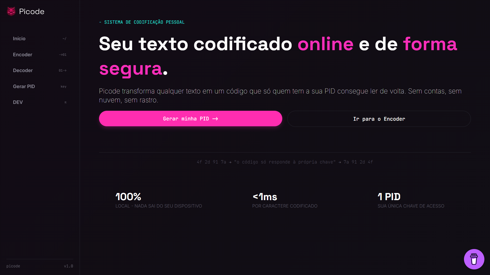

# Picode



**Picode** é um sistema pessoal de codificação de texto que funciona 100% no navegador. Com uma chave única (a **PID**), você transforma qualquer texto em um código que só quem possui a mesma PID consegue decifrar de volta — sem contas, sem servidor e sem nuvem.

```
448795245986 → "o código só responde à própria chave" → 235647894102
```

[👉 Teste agora 🔗](https://picode-cipher.netlify.app/)

## ✨ Funcionalidades

- 🔑 **Geração de PID** — crie sua chave pessoal de codificação com um clique
- 🔒 **Encoder** — codifique qualquer texto usando sua PID
- 🔓 **Decoder** — decodifique de volta ao texto original com a PID correta
- 📁 **Upload de arquivo** — carregue um `.txt` diretamente para codificar/decodificar
- 📋 **Copiar e baixar** — copie o resultado ou baixe como arquivo `.txt`
- 💻 **100% local** — toda a codificação acontece no dispositivo do usuário, nada é enviado para fora
- ⚡ **Rápido** — processamento em menos de 1ms por caractere

## 🧠 Como funciona

O Picode utiliza uma cifra própria, feita em duas camadas:

1. **PID (Picode ID)** — uma chave gerada aleatoriamente que associa cada caractere suportado (letras, números, acentos, pontuação e símbolos) a um número exclusivo de 3 dígitos, salva no `localStorage` do navegador.
2. **Surface Code** — cada caractere do texto é substituído pelo trecho de 3 dígitos correspondente na PID.
3. **Deep Code** — cada bloco de 3 dígitos do Surface Code é ofuscado com um número aleatório maior ("adder") e seu complemento ("filler"), gerando um código final de 6 dígitos por caractere. Isso garante que o mesmo texto nunca gere exatamente o mesmo código duas vezes, mesmo usando a mesma PID.

Para decodificar, o processo é revertido: o Deep Code é reduzido ao Surface Code (subtraindo o filler do adder) e, em seguida, cada trecho é comparado com a PID para recuperar o caractere original.

> ⚠️ Sem a PID correta, não é possível reverter o código — por isso é essencial guardar sua chave em um local seguro.

## 🚀 Como usar

1. Acesse a página [Gerar PID](https://picode-cipher.netlify.app/pages/generate_pid) e clique em **GERAR NOVA PID** para criar sua chave pessoal (ela é salva automaticamente no seu navegador).
2. Guarde essa PID em um local seguro — ela é a única forma de decodificar suas mensagens depois.
3. Na página [Encoder](https://picode-cipher.netlify.app/pages/encoder), digite ou envie um arquivo `.txt` com o texto desejado e clique em codificar.
4. Copie ou baixe o código gerado e compartilhe com quem também tiver a mesma PID.
5. Na página [Decoder](https://picode-cipher.netlify.app/pages/decoder), cole o código recebido para recuperar o texto original.

## 🛠️ Tecnologias

- HTML5
- SASS para estilização
- CSS3 gerado automaticamente com SASS
- JavaScript (vanilla, sem frameworks ou dependências externas)
- `localStorage` para persistência local da PID

## 🔐 Sobre a segurança

Todo o processo de codificação e decodificação acontece **inteiramente no navegador do usuário**. Nenhum texto, arquivo ou PID é enviado para servidores externos — a chave fica salva apenas localmente, no `localStorage` do próprio dispositivo.

## 👨‍💻 Autor

Feito por **Pierry Savio**.

- 💬 [Falar no WhatsApp](https://wa.me/5511974838207)
- ☕ [Pagar um café](https://buymeacoffee.com/pierrysavio)

Se este projeto te ajudou de alguma forma, considere deixar uma ⭐ no repositório!
